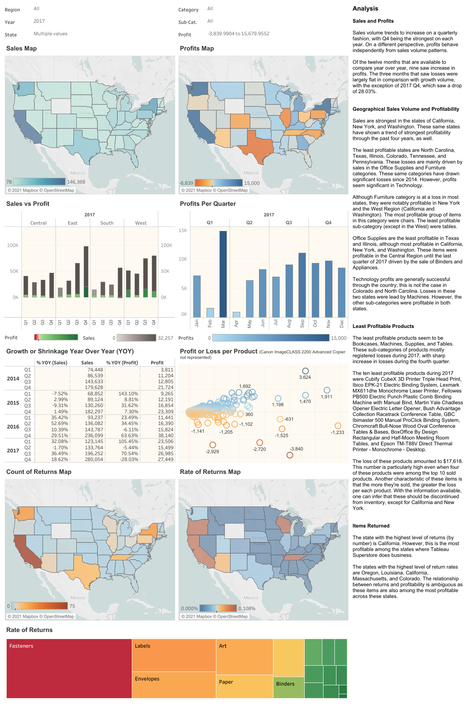

# Tableau Superstore Sales

## Analysis 
  
### Sales and Profits 
  
Sales volume trends to increase on a quarterly fashion, with Q4 being the strongest on each year. On a different perspective, profits behave independently from sales volume patterns. 
  
Of the twelve months that are available to compare year over year, nine saw increase in profits. The three months that saw losses were largely flat in comparison with growth volume, with the exception of 2017 Q4, which saw a drop of 28.03%. 
  
  
### Geographical Sales Volume and Profitability 
  
Sales are strongest in the states of California, New York, and Washington. These same states have shown a trend of strongest profitability through the past four years, as well. 
  
The least profitable states are North Carolina, Texas, Illinois, Colorado, Tennessee, and Pennsylvania. These losses are mainly driven by sales in the Office Supplies and Furniture categories. These same categories have drawn significant losses since 2014. However, profits seem significant in Technology. 
  
Although Furniture category is at a loss in most states, they were notably profitable in New York and the West Region (California and Washington). The most profitable group of items in this category were chairs. The least profitable sub-category (except in the West) were tables. 
  
Office Supplies are the least profitable in Texas and Illinois, although most profitable in California, New York, and Washington. These items were profitable in the Central Region until the last quarter of 2017 driven by the sale of Binders and Appliances. 
  
Technology profits are generally successful through the country; this is not the case in Colorado and North Carolina. Losses in these two states were lead by Machines. However, the other sub-categories were profitable in both states. 
  
  
### Least Profitable Products 
  
The least profitable products seem to be Bookcases, Machines, Supplies, and Tables. These sub-categories of products mostly registered losses during 2017, with sharp increase in losses during the fourth quarter. 
  
The ten least profitable products during 2017 were Cubify CubeX 3D Printer Triple Head Print, Ibico EPK-21 Electric Binding System, Lexmark MX611dhe Monochrome Laser Printer, Fellowes PB500 Electric Punch Plastic Comb Binding Machine with Manual Bind, Martin Yale Chadless Opener Electric Letter Opener, Bush Advantage Collection Racetrack Conference Table, GBC Ibimaster 500 Manual ProClick Binding System, Chromcraft Bull-Nose Wood Oval Conference Tables & Bases, BoxOffice By Design Rectangular and Half-Moon Meeting Room Tables, and Epson TM-T88V Direct Thermal Printer - Monochrome - Desktop. 
  
The loss of these products amounted to $17,618. This number is particularly high even when four of these products were among the top 10 sold products. Another characteristic of these items is that the more they're sold, the greater the loss per each product. With the information available, one can infer that these should be discontinued from inventory, except for California and New York. 
  
  
### Items Returned 
  
The state with the highest level of returns (by number) is California. However, this is the most profitable among the states where Tableau Superstore does business. 
  
The states with the highest level of return rates are Oregon, Louisiana, California, Massachusetts, and Colorado. The relationship between returns and profitability is ambiguous as these items are also among the most profitable across these states.

### GitHub Repository

GitHub Title: Tableau: https://github.com/ivanzapatarivera/Tableau

### Screenshot

